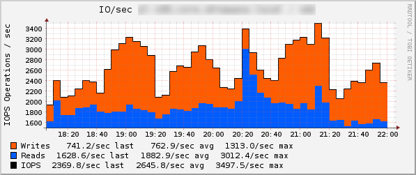

diskstats
=========

Modification of check_mk diskstats, compute additional metrics 
in way as they are calculated by the iostat http://code.google.com/p/tester-higkoo/source/browse/trunk/Tools/iostat/iostat.c:

* improved iops metric with read and write values
* util %
* average queue length
* average request size
* average time IOs served

