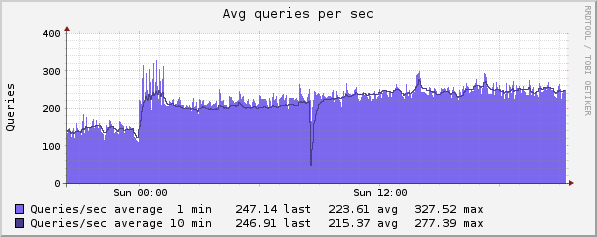
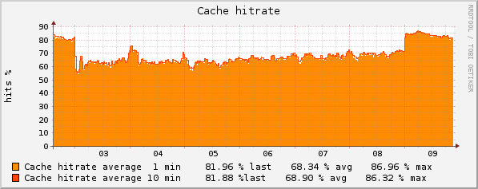

pdns_stats
==========

Retrive data from internal webserver of PowerDNS about:
* Avg queries per sec
* Cache hitrate
* Backend query load
* Backend query cache hitrate
* Question/answer latency

Test if average number of queries per second in one minute window is on warning or critical level.


Example of declaration in mrpe.cfg:

```
Pdns  pdns_stats.rb http://127.0.0.1:8081 admin PASSWORD 100 200
```



